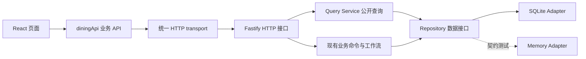

# API 与数据访问层

## 分层约定

- `app/src/api/dining.js`：页面唯一业务数据入口。提供 workspace、feedback、actions、catalog、plans、analytics、imports、system、prompts，读取/写入/上传/下载地址均从这里调用，组件不再拼HTTP路由或自行fetch。
- `app/src/api/http.js`：唯一浏览器网络调用位置，统一base URL、查询编码、JSON与二进制上传、错误处理。读取默认GET，命令显式POST/PATCH；不自动重试写请求。
- `app/src/api.js`：只保留浏览器CSV导出和金额格式化，不再负责远程数据访问。图表和本地筛选可计算已通过API获得的数据，不属于第二数据源。
- `app/server/data/query-service.mjs`：所有公开GET数据的查询与响应投影，`/api/data`工作台快照和分资源接口共用这些方法。过滤内部Prompt/配置仍由公开数据边界执行。下载文件位置只供路由流式读取，不作为公开数据库接口。
- `app/server/data/repository.mjs`：统一集合、读取、写入、同步事务和关闭契约，业务服务不依赖SQL实现。
- `app/server/data/sqlite-adapter.mjs`：唯一生产SQL位置，管理连接、预编译语句及schema版本。`store.mjs`是保留旧调用兼容的工厂。
- `app/server/data/memory-adapter.mjs`：仅用于独立适配器契约测试，不会在SQLite故障时自动切换，避免丢失持久化。

## 读取接口

| 接口 | 返回 |
| --- | --- |
| `GET /api/data` | 同一查询层组装的启动快照，保持已有字段兼容 |
| `GET /api/feedback` | 反馈记录数组，示例带demo标记 |
| `GET /api/dishes` | 菜品记录数组 |
| `GET /api/actions` | 事项记录数组；聚合模块自行选取有效聚合事项 |
| `GET /api/plans` | 菜单摘要及countEntries，不附整份entries |
| `GET /api/menu-runs` | 最近30次真实生成的恢复元数据：进度、可恢复状态、安全诊断；不含原始模型响应 |
| `GET /api/menu-runs/:id/result` | 读取已完成菜单，不调用AI、不自动保存；重新检查过期状态 |
| `GET /api/imports` | 最近20个转换批次 |
| `GET /api/feedback/insights?month=` | 全部/指定月份真实统计及词频 |
| `GET /api/imports/:id/rows` | 指定转换批次十列新表 |
| `GET /api/imports/:id/download?format=xlsx` | 新格式工作簿；也支持csv |
| `GET /api/prompt-config` | 专用配置DTO、当前启用规则、已批准排菜Action与实际组合Prompt预览 |

### Prompt 配置写入与运行快照

`diningApi.prompts.save` 使用 `PUT /api/prompt-config`，严格提交 `{version,baseFingerprint,actionGenerationText,menuSystemText,approvedActionText,rules}`；成功返回新配置及预览。保存原子写入 `meta.prompt-config:current`、`meta.prompt-config:version-N` 与audit，不写原始 `meta.rules`、菜品或Action审批。版本或来源变化返回409，无变更不写多余历史。此页是用户显式要求的可见业务Prompt边界，`/api/data`、菜单运行等原有接口仍过滤 `promptConfig`、原始Prompt/输入、尝试记录和密钥；旧`/api/settings`接口保持停用。

新排菜运行保存menuSystem/approvedAction文本与版本、有效规则及独立原始sourceRules快照，每档读取该快照不读取最新配置。运行中保存新版本不混入当前已选菜单；旧菜单会显示配置过期，恢复/复检禁止混合版本。人工/固定出品属性始终依据原始来源，不根据可编辑文案猜测；其他本地硬校验只读展示，文本编辑不自动更改程序阈值。

`prompt-builders.mjs` 同时构造真实请求与预览；单档预览保留原Action优先级/版本，按targetStall过滤清单，完整instructions含Responses边界。Action聚合缓存存实际Prompt哈希，编辑后下次会重新分析，已生成事项仍保留人工审批/标题与执行要求。配置GET不写数据库，也不调用模型。

已有菜单明细/检验、反馈回复/月报、Action汇总审批、POS、来源资料等接口保持原路径与业务行为。API供本机、显式启用的公司内网或 Cloudflare 演示隧道访问，隧道支持 `none` 和 `basic` 两种认证模式；没有新增任意表查询、SQL执行或原始数据库下载接口。

`POST /api/plans/resume` 严格接收 `{runId}`，与新生成/重检共用进程内互斥锁。后端校验源规则、菜库、Action、配置和已有周次，创建带 `parentRunId` 的新运行，只请求剩余周次或独立检验。错误只额外返回 `runId` 和白名单定位字段；原始尝试保存在私有 `menuRuns.plannerAttempts`，不进入公开 API。前端通过 `diningApi.plans.recoverableRuns/resume/result` 调用。

### 菜单逐周进度流

- `POST /api/plans/generate-stream`：正式 AI 生成，同原生成参数，`useAi:true`、非 demo。
- `POST /api/plans/resume-stream`：严格 `{runId}`，恢复既有成功周次。两者与原生成/检验/恢复共用互斥锁，旧 JSON 接口保留兼容。
- 响应为 `application/x-ndjson`；事件依次 `started`、每周一个 `week`、`inspecting`、`completed`，等待期间有 `heartbeat`。途中失败发 `error`；尚未开始时失败仍为非 200 JSON。流连接正常不等于生成成功，只有 `completed.plan` 是最终结果。
- `week.plan` 只有已校验并落库的周次，包含 `partial:true/completedWeeks/generationRunId`，不附虚构的未来槽位或检验结论。后端在请求下一周前发送此事件，下一周 AI 输入包含此前全部成功菜单。
- `diningApi.plans.generateProgressive/resumeProgressive` 经统一 `http.stream` 处理分块 UTF-8、半行、错误与中断；用 `onEvent` 更新页面，最终返回完整菜单。浏览器不自动重发付费 POST。
- 流式响应仍经过 `publicData` 公开字段过滤；不提供原始 Prompt、模型尝试或密钥。部分菜单不能保存或送检；删掉 `partial` 标识仍不能绕过 `gpt-direct` 所需的服务端完成记录。断开不取消后台业务，慢客户端背压最多等待 30 秒，之后分离显示连接继续生成。

### 按档口生成和客观评分数据

原菜单Excel仅由显式离线命令 `tools/Import-StallCatalog.mjs --apply` 读取，一次性备份并事务入库。具体菜品在 `dishes`，12档来源映射、原文件SHA256、来源单元格、去重和异常在 `meta.preprocessed-stall-catalog`（`storageMode=database/importVersion=stall-import-v1`）。重复导入幂等，已有ID和人工字段保留。`stored-stall-catalog.mjs` 是无文件I/O的运行时投影，按库中来源关联及当前active/标签计算候选；启动/生成/恢复/复检不读原菜单Excel，也不检查它是否还在。规则Excel同步仍独立保留。新运行版本仍为 `gpt-stall-v1`，每次一个档口一周，每周统一输出保持 `gpt-direct-v2` 和原NDJSON兼容。

私有 `menuRuns.stallBatches` 保存每周每档的成功输出、纠错次数、来源运行和用量，`plannerAttempts` 保留所有收到的尝试。恢复核对连续周/档顺序、格式与业务/文件指纹；已完成档口不再调用。`usage` 记录本次所有已返回用量，`acceptedOutputUsage` 记录最终采用的输出用量，`reusedUsage` 记录复用的历史输出，两者不能当本次新增账单。原始批次和Prompt不经 `publicData` 回传。

`plan.workflow.score` 为服务端投影：`value/target/targetMet/version/label/dimensions/blockers/unknownCount/summary`，目标80、版本 `menu-score-v1`。五维权重30/25/20/15/10，总分由实际菜单、本地校验、独立检验及可信Action落实记录计算；不信任客户端传入的分数，未完整审核或已过期时value为null，不改变审批状态。`workflow.catalogInfo` 只在实际按档口生成的运行中提供来源文件指纹、各档候选数/来源/未匹配数和预处理统计，不把旧菜单说成已按新方式生成。

`workflow.actionImpacts` 保持原接口并按Action/周合并所有目标档口的review；页面展示批准要求、执行状态和实际菜品位置。全部档口Action不能因为每档各报一条而误判为永远部分落实。分值、冲突和Action均经现有 `diningApi` 获取，页面不读库、不自行补分。

### 常驻排菜 Action 当前清单

六周菜单的常驻排菜Action面板复用 `diningApi.workspace.load()` 返回的 `actions`，与Action模块共用保存后的刷新，不新增本地数据副本或隐藏的AI调用。`shared/menu-action-state.mjs` 为纯状态投影；前端展示和服务端 `approvedMenuActions` 共用 `isApprovedMenuAction`，统一正式数据、反馈关联、审批、启用及非空排菜要求的参与条件。服务与其他无排菜要求的改善分开统计。当前面板是下一次生成的候选要求，`workflow.actionImpacts` 仍是该菜单生成/检验时的证据，两者不相互覆盖。

### 菜单冲突定点修复

`diningApi.plans.repair({plan, issue})` 调用 `POST /api/plans/repair`；issue 严格包含 `code/stall/date/meal/text`。与生成、恢复、检验共享互斥锁，不绕过数据API。返回 `{plan, repair:{status, changedEntries, summary}}`，status 为 `repaired` 或 `unchanged`。

服务端恢复可信完整真实 GPT 运行记录，重新校验当前菜单并确认目标问题仍然存在；不信任客户端传入的分数、核验状态、标签、固定来源或价格规则。拒绝部分/模拟/无运行记录、变更的日期餐次配置，以及已经变化的来源、菜库、批准Action和内部配置。仅菜单菜品被手工修改时允许继续定点修复。

候选仅取数据库映射的本档有效菜品，按槽位价位、已有核验字段和共享来源进一步限定。模型仅返回定长局部索引，无法指定外档、日期或其他槽位。每次最多一次配置的 Azure Responses 调用，不自动重试；模型返回后再次检查输入来源快照。整份六周本地问题按完整身份多重集比较：目标code在该餐次的所有级别问题必须减少，且不得新增其他错误/提醒或降低标签覆盖，才返回修改草案。

修复不写回 `plans/menuRuns/dishes/actions`，成功时仅增加 `audit` 的 `menu.conflict.repaired` 槽位前后ID与指纹，以及由AI客户端记录用量。`workflow.repairPendingInspection` 由服务端实际菜单指纹差异推导，后续 `/plans/check` 仍保留；`workflow.stale=true` 且 score.value=null。重新独立检验生成新的可信运行后清除过期状态。前端在复检前禁用保存，旧 Action 落实记录明确标为历史证据，不假称当前落实。

## 公司内网访问

`DINING_NETWORK=local` 是默认值，服务仅监听本机。`DINING_NETWORK=lan` 监听 `0.0.0.0:4317`（端口可配置），由同一服务提供构建后的静态页面和 `/api`。使用 `.\tools\Start-Dining.ps1 -NetworkMode lan` 可覆盖 `app/.env`；切回 `-NetworkMode local` 仅供本机访问。

Host 仅允许 loopback，以及 `lan` 模式下本机实际网卡的 RFC1918 私网 IPv4（`10.0.0.0/8`、`172.16.0.0/12`、`192.168.0.0/16`）。内网浏览器写请求须来自同一 Host、协议和端口，保留已有 loopback 开发来源；不开放CORS。当前本机内网地址为 <http://10.2.165.12:4317>，访问还需公司网络互通及防火墙允许该端口入站。此模式未添加登录验证，不适用于公网部署。

## Cloudflare 临时演示入口

保持应用运行后，使用 `.\tools\Start-DiningTunnel.ps1 -Authentication none` 启动无需登录的后台 Quick Tunnel；默认将公网 HTTPS 请求经 `cloudflared` 转到本机 `127.0.0.1:4319` 的网关，再代理到 `127.0.0.1:4317`。`none` 模式下，页面、API、上传和下载直接可访问，不生成或提示凭据，持有地址的人可以查看和操作项目。网关只监听 loopback，两种模式都保留 HTTPS、当前隧道的 Host/Origin 校验和上游 loopback 限制。应用原有 Host/Origin 检查及 `DINING_NETWORK` 配置保持不变，不开放 CORS，前端继续使用相对地址 `/api`。

显式选择的模式保存在私有文件 `app/data/cloudflare/settings.json`，后续不带 `-Authentication` 参数时复用；尚未保存模式时默认 `basic`。恢复口令时先运行 `.\tools\Stop-DiningTunnel.ps1`，再运行 `.\tools\Start-DiningTunnel.ps1 -Authentication basic`；切换到 `none` 也需先停止再启动。`basic` 模式对所有资源验证 Basic Auth，账号为 `dining`，首次生成随机口令并保存到 `credentials.json`，启动时输出 `app/data/cloudflare/access.txt` 凭据路径。设置、凭据和程序文件均由 Git 忽略。

停止脚本只关闭隧道和网关，不停止应用。电脑须保持运行和联网；Quick Tunnel 重启后地址改变且没有 SLA，两种认证模式均不验证公司身份。此入口用于短期演示，固定域名及公司 SSO 需另行配置 Cloudflare Access。

## 后续迁移方式及边界

1. **迁移Web/API地址**：设置公开配置`VITE_API_BASE_URL`后重新构建，所有查询、上传及下载地址一起切换。默认`/api`；优先由部署环境同源反向代理转发到后端。配置绝不能放API密钥。
2. **部署到其他域名**：内网模式仅放行本机实际私网IPv4，仍限制Host/Origin，未开放CORS。临时 Cloudflare 入口由独立网关按所选认证模式代理；固定域名或正式部署仍需配置对应认证、TLS和来源白名单，不能仅修改URL。
3. **迁移数据存储**：替换Repository适配器并跑相同契约及HTTP集成测试，保持ID、时间精度、证据、审批版本、顺序和事务回滚语义。当前业务事务是同步接口；PostgreSQL等异步驱动需要进一步改造事务/工作单元，不宣称可直接塞入异步驱动。
4. **迁移文件存储**：原始上传与转换XLSX/CSV目前仍在`app/data`目录。公开下载已统一由API提供，迁移对象存储时还需替换bootstrap/转换产物存储与查询层的文件读取实现。
5. **大数据量**：保留`/api/data`兼容快照，尚未实现服务端分页。独立资源接口已经可用；后续分页应以明确契约升级，不由页面直读数据库绕过API。

## 本地数据库规整

使用`PRAGMA user_version=1`记录结构版本。旧库版本0仅创建缺失集合并标记版本，不重写、删除或重新导入现有记录。遇到比应用更高的版本立即拒绝打开，不静默降级。正常重启不清库，不覆盖人工回复或审批。生产重启前对当前SQLite做一致性备份，验证迁移前后所有业务表行摘要相同。

契约测试覆盖SQLite与独立Memory适配器、旧库无损升级、未知集合拒绝、事务回滚、页面禁止绕过业务API、可配置base URL、二进制原件上传和下载地址复用。
