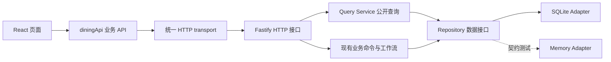

# API 与数据访问层

## 分层约定

- `app/src/api/dining.js`：页面唯一业务数据入口。提供 workspace、feedback、actions、catalog、plans、analytics、imports、system，读取/写入/上传/下载地址均从这里调用，组件不再拼HTTP路由或自行fetch。
- `app/src/api/http.js`：唯一浏览器网络调用位置，统一base URL、查询编码、JSON与二进制上传、错误处理。读取默认GET，命令显式POST/PATCH；不自动重试写请求。
- `app/src/api.js`：只保留浏览器CSV导出和金额格式化，不再负责远程数据访问。图表和本地筛选可计算已通过API获得的数据，不属于第二数据源。
- `app/server/data/query-service.mjs`：所有公开GET数据的查询与响应投影，`/api/data`工作台快照和分资源接口共用这些方法。过滤内部Prompt/配置仍由公开数据边界执行。下载文件位置只供路由流式读取，不作为公开数据库接口。
- `app/server/data/repository.mjs`：统一集合、读取、写入、同步事务和关闭契约，业务服务不依赖SQL实现。
- `app/server/data/sqlite-adapter.mjs`：唯一生产SQL位置，管理连接、预编译语句及schema版本。`store.mjs`是保留旧调用兼容的工厂。
- `app/server/data/memory-adapter.mjs`：仅用于独立适配器契约测试，不会在SQLite故障时自动切换，避免丢失持久化。

## 读取接口

| 接口 | 返回 |
| --- | --- |
| `GET /api/data` | 同一查询层组装的启动快照，保持已有字段兼容 |
| `GET /api/feedback` | 反馈记录数组，示例带demo标记 |
| `GET /api/dishes` | 菜品记录数组 |
| `GET /api/actions` | 事项记录数组；聚合模块自行选取有效聚合事项 |
| `GET /api/plans` | 菜单摘要及countEntries，不附整份entries |
| `GET /api/imports` | 最近20个转换批次 |
| `GET /api/feedback/insights?month=` | 全部/指定月份真实统计及词频 |
| `GET /api/imports/:id/rows` | 指定转换批次十列新表 |
| `GET /api/imports/:id/download?format=xlsx` | 新格式工作簿；也支持csv |

已有菜单明细/检验、反馈回复/月报、Action汇总审批、POS、来源资料等接口保持原路径与业务行为。API仍仅供本机可信操作；没有新增任意表查询、SQL执行或原始数据库下载接口。

## 后续迁移方式及边界

1. **迁移Web/API地址**：设置公开配置`VITE_API_BASE_URL`后重新构建，所有查询、上传及下载地址一起切换。默认`/api`；优先由部署环境同源反向代理转发到后端。配置绝不能放API密钥。
2. **部署到其他域名**：本轮没有取消服务器本机Host/Origin限制，也没有开放CORS。直接连接远程域名仍需部署时配置认证、TLS和来源白名单，不仅是改URL。
3. **迁移数据存储**：替换Repository适配器并跑相同契约及HTTP集成测试，保持ID、时间精度、证据、审批版本、顺序和事务回滚语义。当前业务事务是同步接口；PostgreSQL等异步驱动需要进一步改造事务/工作单元，不宣称可直接塞入异步驱动。
4. **迁移文件存储**：原始上传与转换XLSX/CSV目前仍在`app/data`目录。公开下载已统一由API提供，迁移对象存储时还需替换bootstrap/转换产物存储与查询层的文件读取实现。
5. **大数据量**：保留`/api/data`兼容快照，尚未实现服务端分页。独立资源接口已经可用；后续分页应以明确契约升级，不由页面直读数据库绕过API。

## 本地数据库规整

使用`PRAGMA user_version=1`记录结构版本。旧库版本0仅创建缺失集合并标记版本，不重写、删除或重新导入现有记录。遇到比应用更高的版本立即拒绝打开，不静默降级。正常重启不清库，不覆盖人工回复或审批。生产重启前对当前SQLite做一致性备份，验证迁移前后所有业务表行摘要相同。

契约测试覆盖SQLite与独立Memory适配器、旧库无损升级、未知集合拒绝、事务回滚、页面禁止绕过业务API、可配置base URL、二进制原件上传和下载地址复用。
